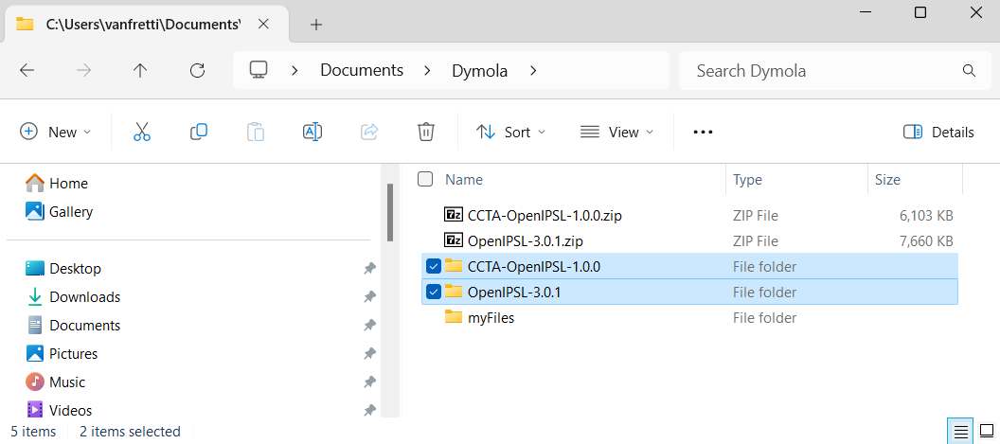
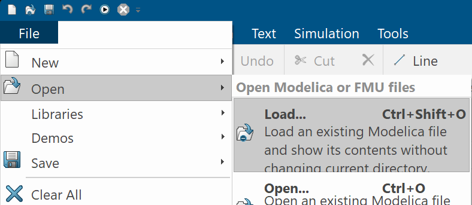
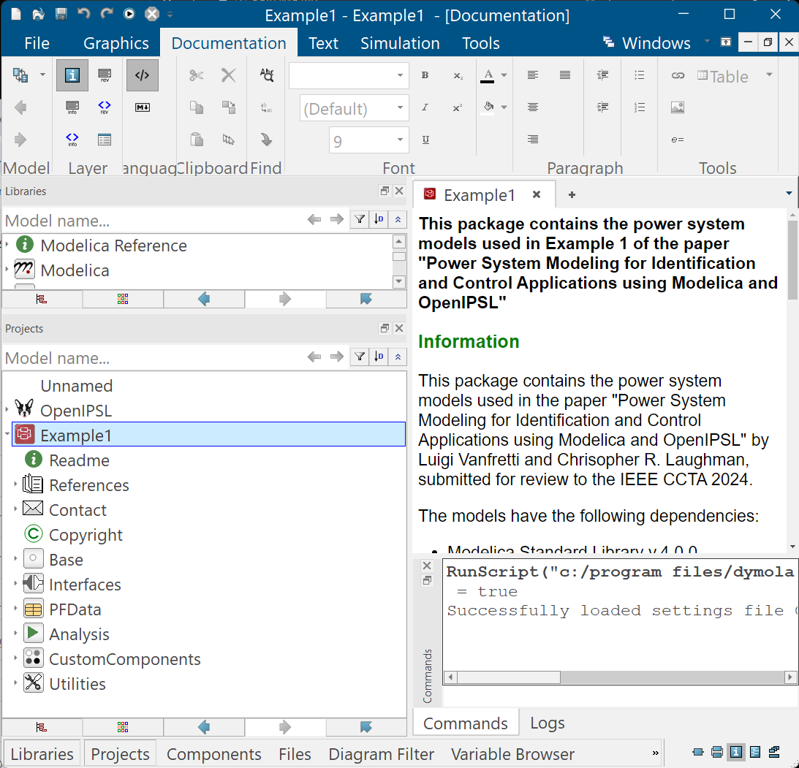
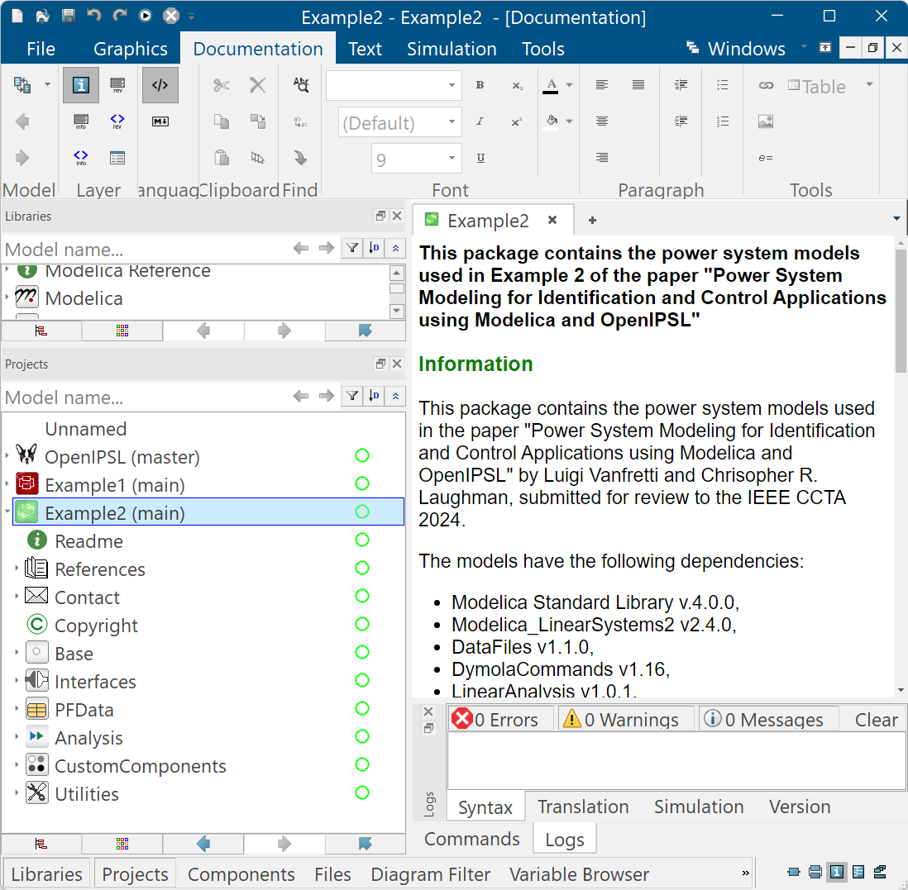

## Quickstart Guide - Dymola
While using these models would require some familiarity with Modelica and Dymola, the packages have been setup so that users without such experience can run some of the default simulations and linearization examples. In the instructions below, we illustrate how to load the OpenIPSL library and the `Example1` & `Example2` packages:
  1. Download OpenIPSL, [here](https://github.com/OpenIPSL/OpenIPSL/). You can clone it with GIT by using [a8c6758](https://github.com/OpenIPSL/OpenIPSL/commit/a8c6758fffa7bd23f925063e9aa075f271ac71ee). Alternatively, you can download the *.zip file from the release page [here](https://github.com/OpenIPSL/OpenIPSL/releases/tag/v3.0.1).
  2. Download the files of this repository by cloning with GIT. Alternatively, you can click [here](https://github.com/ALSETLab/CCTA-OpenIPSL/archive/refs/tags/v1.0.2.zip) to download the *.zip file.
  3. If you have cloned both OpenIPSL's and this repository, navigate to the location where it is stored them. If you have downloaded the *.zip file, uncompress it in a directory to which you have read/write rights, e.g. `C:\Users\myUserName\Documents\Dymola`. You should now have two directories, one called `OpenIPSL-3.0.1` and the other `CCTA-OpenIPSL-1.0.x`, as shown below. Note that `x` denotes the version of the release of this repository.
  
  4. Launch Dymola 2024X and go to `File > Open > Load`, and navigate the folder `C:\Users\myUserName\Documents\Dymola\OpenIPSL-3.0.1\OpenIPSL-3.0.1\OpenIPSL\`, select the file `package.mo` and click on `Open`
   
   
   This will load OpenIPSL on Dymola's `Projects` browser as shown below:
   
   5. Repeat step 4, but instead, navigate to the directory `C:\Users\myUserName\Documents\Dymola\CCTA-OpenIPSL-1.0.x\Example1`, select the file `package.mo` and click on `Open`. This will load the package, `Example1` in Dymola's `Projects` browser as shown below.
   
   6. Repeat step 5, but instead, `C:\Users\myUserName\Documents\Dymola\CCTA-OpenIPSL-1.0.x\Example2`, select the file `package.mo` and click on `Open`. This will load the package, `Example2` in Dymola's `Projects` browser as shown below.
   
   7. You have now loaded the two packages from this repository in Dymola. You can now click on `Example1 > Readme` or `Example2 > Readme` and follow the instructions on how to run some default examples. 
      - For example, to reproduce the comparisons between the linear and nonlinear model response of `Example 1` as shown in Fig. 6 of [Reference 1](http://dx.doi.org/10.13140/RG.2.2.17471.11680), follow the instructions [here](https://alsetlab.github.io/CCTA-OpenIPSL/Example1/help/Example1_Analysis_LinearAnalysis_CustomFunctions.html#Example1.Analysis.LinearAnalysis.CustomFunctions.LinearizeAndCompare)
   8. Explore all other examples in the documentation!
      * Documentation for Example 1 can be found [here](https://alsetlab.github.io/CCTA-OpenIPSL/Example1/help/Example1.html)
      * Documentation for Example 2 can be found [here](https://alsetlab.github.io/CCTA-OpenIPSL/Example2/help/Example2.html)

To go back to the main page, click [here](../README.md)