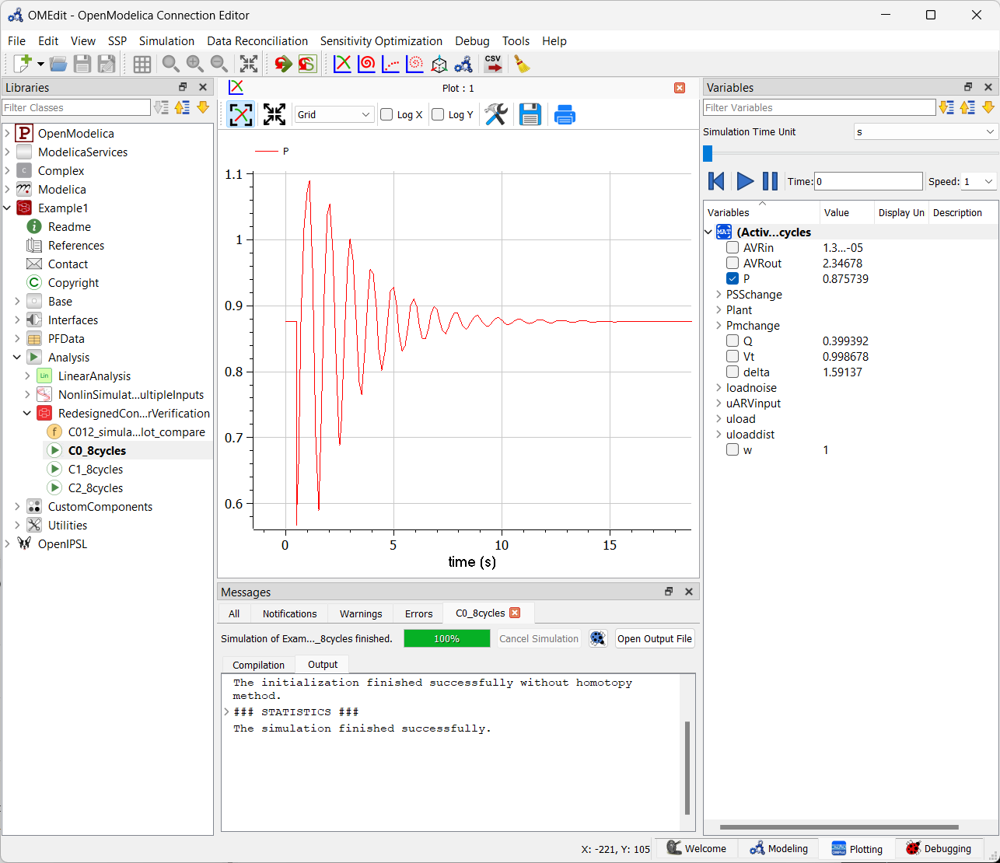

## Quickstart Guide - OpenModelica
While using these models would require some familiarity with Modelica and OpenModelica, the packages have been setup so that users without such experience can run some basic simulations. 

In the instructions below, we illustrate how to load the OpenIPSL library and the `Example1` & `Example2` packages and run a simulation for each of the packages.

## Part 1: Installing OpenIPSL using OpenModelica's Package Manager
- Download and install OpenModelica, [here](https://openmodelica.org/download/download-windows/). The version used in this guide is [1.22.3](https://github.com/OpenModelica/OpenModelica/milestone/50?closed=1).
- Follow the instructiosn in the following guide to add OpenIPSL into your OpenModelica installation and test that is working:
  - Slides: [here](http://dx.doi.org/10.13140/RG.2.2.33842.58562)
  - Video: [here](https://youtu.be/Q0lhw19Sl2E)

## Loading `Example1` & `Example2`
  1. Download the files of this repository by cloning with GIT. Alternatively, you can click [here](https://github.com/ALSETLab/CCTA-OpenIPSL/archive/refs/tags/v1.0.2.zip) to download the *.zip file.
  2. If you have cloned this repository, navigate to the location where it is stored. If you have downloaded the *.zip file, uncompress it in a directory to which you have read/write rights, e.g. `C:\Users\myUserName\Documents\OM`. You should now have a folder called `CCTA-OpenIPSL-1.0.x`.
  3. Open OMEdit. If you can't find it, look under `C:\Program Files\OpenModelica1.22.3-64bit\bin` and run `OMEdit.exe` by double-clicking. 
  4. Go to `File > Open Model/Library Files(s) `, and navigate the folder `C:\Users\myUserName\Documents\OM\CCTA-OpenIPSL-1.0.1\CCTA-OpenIPSL-1.0.1\Example1`, select the file `package.mo` and click on OMEdit's `Libraries` browser:
   
   This will load `Example1` and automatically load OpenIPSL (if if Part 1 has been completed) on Dymola's `Projects` browser as shown below:
   
   Note that OpenIPSL has been loaded automatically.
  5. Repeat step 4, but instead, navigate to the sub-folder of Example 2, `C:\Users\myUserName\Documents\OM\CCTA-OpenIPSL-1.0.1\CCTA-OpenIPSL-1.0.1\Example2`, select the file `package.mo` and click on `Open`. This will load the package, `Example2` in OMEdit `Libraries` browser as shown below.
   

## Sample Simulation
### Simulating a model from `Example1`
1. In OMEdit's `Libraries` browser, click through `Example1` until reaching the example: `Example1.Analysis.RedesignedControllerVerification.C0_8cycles`

2. As shown in the the figure above, go to `Simulation > Simulate`, this will start the simulation, and the `Plotting` tab will appear.
3. When the simulation is completed, the `Messages` window will show at the bottom, `The simulation finished successfully.`
4. In the `Variables` window, select `P` to generate the plot displayed below, use the mouse to zoom in to reproduce the plot. 
5. Repeat for any of the other sample simulation models, under `Example1.Analysis.NonlinSimulationsMultipleInputs` or `Example1.Analysis.RedesignedControllerVerification`.
### Simulating a model from `Example2`
Similar to the models in `Example1`, several models are available in `Example2` for simulation. As an example:
1. Navigate to `Example2.Analysis.PFVariant.Ramping_pf`, double click it and then go to `Simulation Setup` as shown in the figure below.

2. Configure the simulation setup as shown in the figure below. Make sure you set the the `Stop Time` to 300 sec and  select only 1 in `Number of Processors`, then click on `OK`... get some :coffee: and relax, now you have to wait for the simulation to run!

3. In the `Plotting` tab, go to the `Variables` window and select `plant.P` to reproduce the plot below.

**Important Note:** OpenModelica has some challenges running the models in `Example2` package. For example, the model above fails to simulate for longer time periods (e.g., set the `Stop Time` to 600 sec and see what happens!). To get an idea of the expected results, browse the documentation of the models in both `Example1.Readme` and `Example2.Readme` to get an idea of the expected output.

## Automation via Scripting and Linear Analysis
Unfortunately it is not as straight forward to demonstrate how to automate simulation and linearization analysis as [as in the case of using Dymola](../QuickstartGuides/Quickstart-Dymola.md) However, it is possible to automate simulations via scripting and perform linear analysis using the `OMNotebook` distributed with OpenModelica or using one of its interfaces, e.g. Python, MATLAB, etc. A tutorial on simulation automation analysis and linearization exxamples is provided in the tutorial that can be found [here](http://dx.doi.org/10.13140/RG.2.2.13206.52809).

To go back to the main page, click [here](../README.md)