## Quickstart Guide - Wolfram System Modeler (WSM)

### What is WSM?
Wolfram System Modeler is developed by Wolfram MathCore, is a simulation software for engineering modeling and simulation based on the Modelica language. Find more information about WSM: [here](https://www.wolfram.com/system-modeler/)

You will need either a trial version or a license for WSM. To get a trial, follow the link [here](https://www.wolfram.com/system-modeler/trial/)

WSM runs on Windows, Mac OSX or Linux, see what versions are supported [here](https://www.wolfram.com/system-modeler/system-requirements/).

It is recommended you get familiar with WSM by following the [WSM Quick Start](https://www.wolfram.com/wolfram-u/courses/modeling-simulation/system-modeler-quick-start-wsm001/).

### Quisktart

While using these models would require some familiarity with Modelica and WSM, the packages have been setup so that users without such experience can run some of the default simulations.

#### A. Part 1:Loading OpenIPSL and the Examples
In the instructions below, we illustrate how to load the OpenIPSL library and the `Example1` & `Example2` packages:
  1. Download OpenIPSL, [here](https://github.com/OpenIPSL/OpenIPSL/). You can clone it with GIT by using [a8c6758](https://github.com/OpenIPSL/OpenIPSL/commit/a8c6758fffa7bd23f925063e9aa075f271ac71ee). Alternatively, you can download the *.zip file from the release page [here](https://github.com/OpenIPSL/OpenIPSL/releases/tag/v3.0.1), uncompress it to a directory where you have read & write rights. For example, `C:\Users\myUserName\Documents\WSM` in Windows or  `/Users/myUserName/Documents/WSM` or OSX.
  2. Download the files of this repository by cloning with GIT. Alternatively, you can click [here](https://github.com/ALSETLab/CCTA-OpenIPSL/archive/refs/tags/v1.0.3.zip) to download the *.zip file.
  3. If you have cloned both OpenIPSL's and this repository, navigate to the location where it is stored them. If you have downloaded the *.zip file, uncompress it in a directory to which you have read &write rights, as in the example in point 1.
  4. Launch WSM and go to `File > Open > `, and navigate the folder `C:\Users\myUserName\Documents\WSM\OpenIPSL-3.0.1\OpenIPSL-3.0.1\OpenIPSL\` in Windows or `/Users/myUserName/Documents/WSM/OpenIPSL-3.0.1/OpenIPSL/`, select the file `package.mo` and click on `Open`
   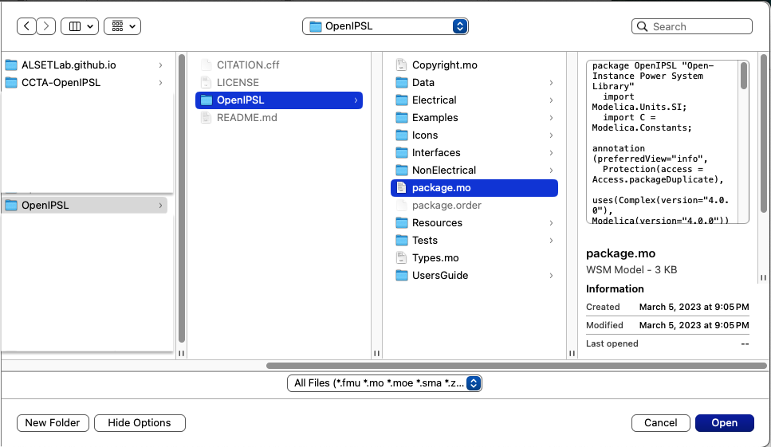
   This will load OpenIPSL on WSM's `Class Browser` under `User Classes`, as shown below:
   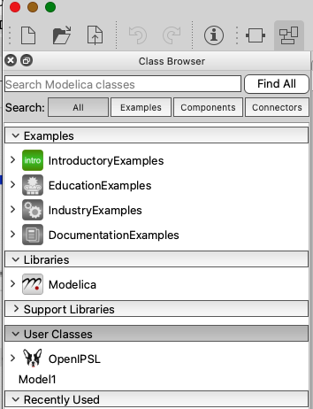
   
  5. Repeat step 4, but instead, navigate to the directory where you uncompressed this repository, e.g., `C:\Users\myUserName\Documents\WSM\CCTA-OpenIPSL-1.0.x\Example1` in Windows or `/Users/myUserName/Documents/WSM/CCTA-OpenIPSL-1.0.x/Example1` in OS X. Then, select the file `package.mo` and click on `Open`. This will load the package, `Example1` in WSM's `Class Browser` browser as shown below.
  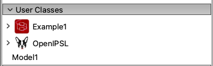
  6. Repeat step 5, but instead, in Windows go to `C:\Users\myUserName\Documents\WSM\CCTA-OpenIPSL-1.0.x\Example2` or in OSX to `/Users/myUserName/Documents/WSM/CCTA-OpenIPSL-1.0.x/Example2`, select the file `package.mo` and click on `Open`. This will load the package, `Example2` in WSM's `User Classes` browser as shown below.
     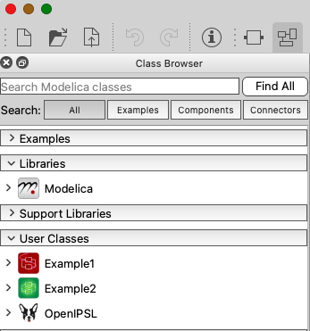

#### B. Validating a Model
Before the models are simulated, is good practice to `Validate` it.

  1. Click the arrow next to the `Example1` red icon and continue navigating in this way until reaching: `Example1.Analysis.RedesignedControllerVerification.C0_8cycles` as shown in the figure below. 
  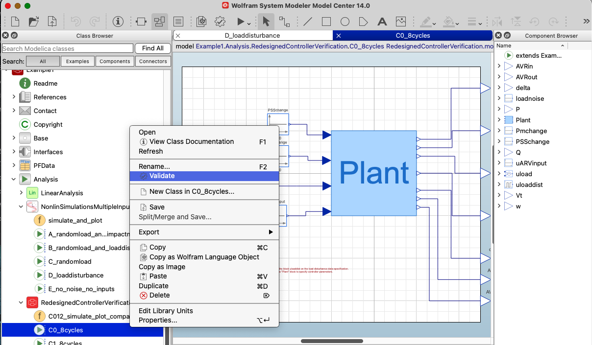
  Right click on the model `C0_8cycles` and then right click on `Validate`. This should result a message in the `Translation` message window similar to the one in the figure below, note that it indicates `Validation of model .... completed successfully`.
    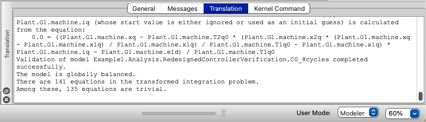

  2. Next, repeat the process for one of the models under the `Example2` package by clicking on the arrow next to the green icon of `Example2` and navigating to `Example2.Analysis.PFVariants.Ramping_pf`.
  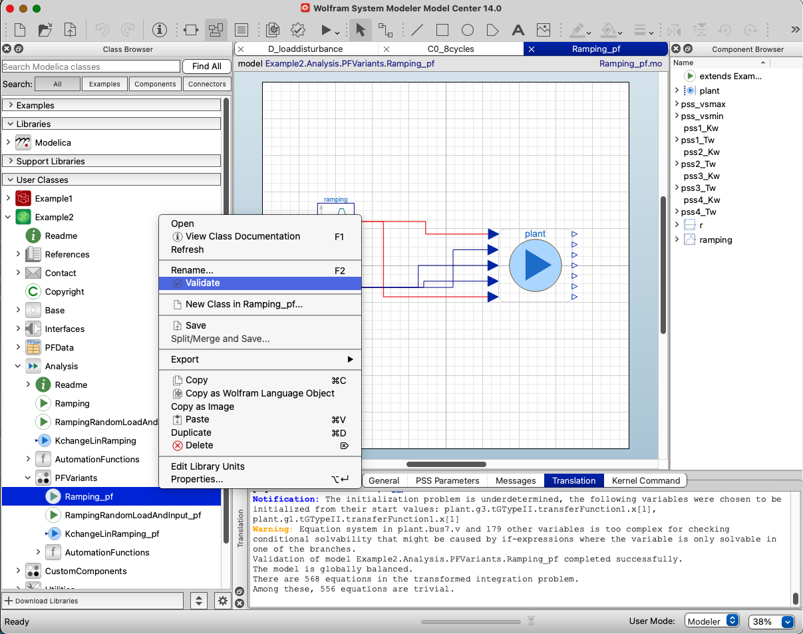
  After validating the model, ou should see in the `Translation` message window similar to that shown for Example 1.

##### Setting the correct version of the Modelica Standard Library in case of a fail in validation or simulation
If validation or simulation fail for either of the listed examples above, you must likely do not have loaded the Modelica Standard Library version 4.0.0. To fix this, go to the `Class Browser` and under `Libraries` right click on `Modelica`. In the pop-up context menu that appears, go to `Version` and select `4.0.0`, as shown in the figure below.
  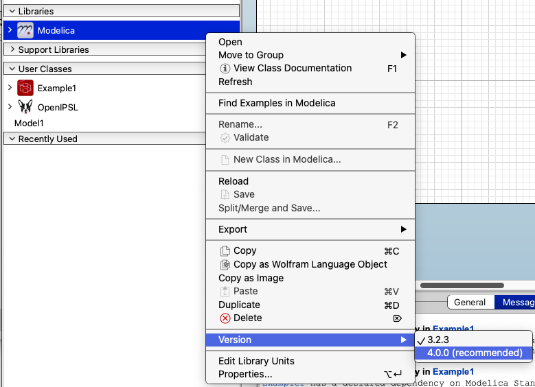.

### C. Simulating a Model
Any of the models that have been validated can be simulated. 
  
  10. Go back to the `C0_8cycles` model and validate it again. After validation, go to the the top of the toolbar and click on the `Simulate Class` button:
  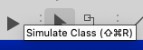.
  10. This will launch WSM's `Simulation Center`, generate the code for the model, compile it and run the simulation. If successfull, the `Simulation Log` will display the simulation statistics. Furthermore, you can plot the simulation results and zoom-in to a region of interest as shown below. See more on how to use the features of Simulation Center [here](https://reference.wolfram.com/system-modeler/U.serGuide/SimulationCenter.html)
    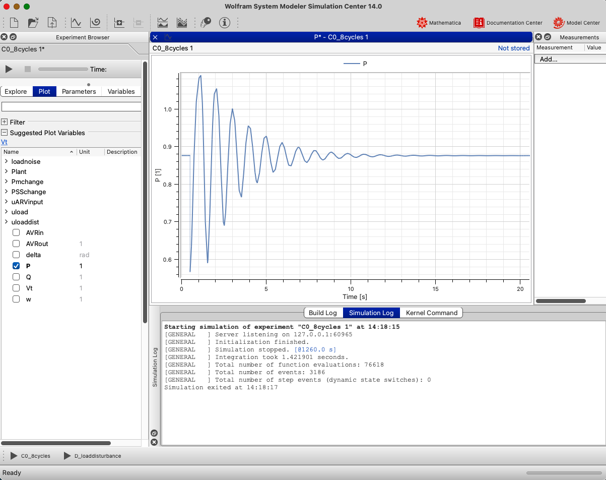
  11. You can now repeat the same process above for a model under the `Example2` package. Navigate to `Example2.Analysis.PFVariants.Ramping_pf` in WSM's Class Browser, validate the model and click on the `Simulate Class` button. This will launch WSM's `Simulation Center` again, which will execute the process required to obtain the simulation results. Once the results are ready, you can plot the results as whon in the figure below.
  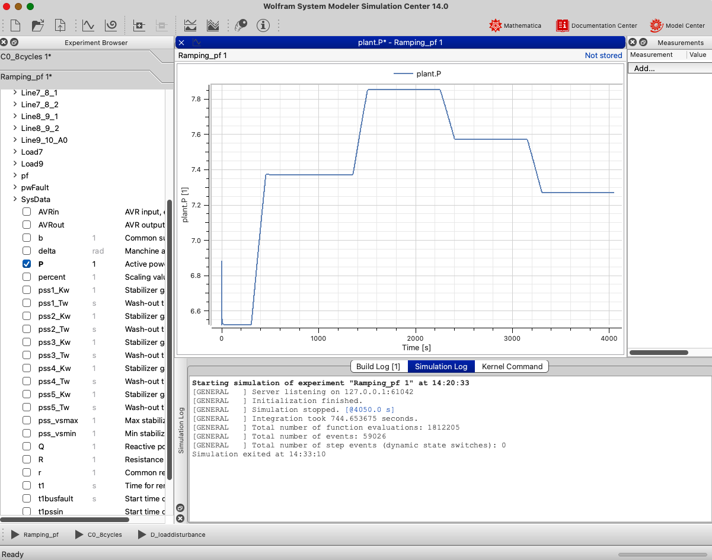
  ***Note:*** be patient, this model will take a while to run in WSM!

### D. Linear Analysis
Performing model linearization and linear analysis requires the use of [Wolfram Mathematica](https://www.wolfram.com/mathematica/) along with WSM. See an example [here](https://reference.wolfram.com/language/ref/SystemModelLinearize.html).

Nevertheless, at the time of writting this documentation and paper (03/2024), the Wolfram Mathcore team informed us that there is a bug in the current version of WSM (v.14.0.0) that prevent's the models from successfully being linearized. You can reach out to Malte Lenz, maltel@wolfram.com, who is dealing with this issue to check if there is any progress since then.

To go back to the main page, click [here](../README.md)