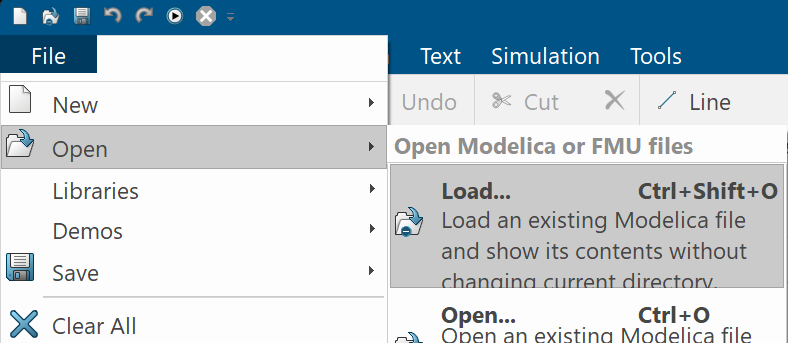
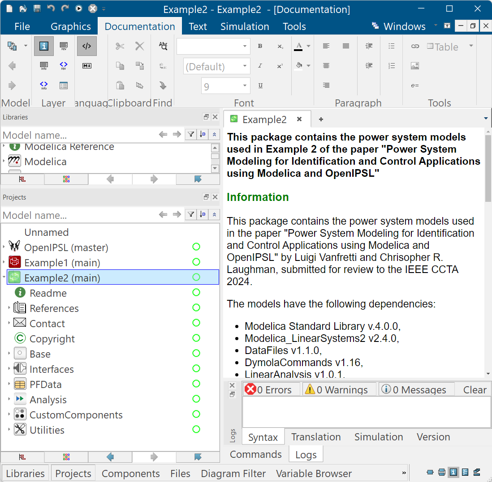

# CCTA-OpenIPSL
Models used in the paper "Power System Modeling for Identification and Control Applications using Modelica and OpenIPSL" by L. Vanfretti and C.R. Laughman.

## General Information
This repository contains the power system models used in the paper "Power System Modeling for Identification and Control Applications using Modelica and OpenIPSL" by Luigi Vanfretti and Chrisopher R. Laughman, submitted for review to the IEEE CCTA 2024, March 2024, DOI: 10.13140/RG.2.2.17471.11680

You can find a pre-print of the paper on ResearchGate, [here](http://dx.doi.org/10.13140/RG.2.2.17471.11680).

The models were developed and tested with [Dymola 2024X](https://www.3ds.com/products/catia/dymola) under MS Windows 11.

The models have the following dependencies:
- [OpenIPSL v.3.0.1](https://github.com/OpenIPSL/OpenIPSL), please download it from this version's library release, [here](https://github.com/OpenIPSL/OpenIPSL/releases/tag/v3.0.1) 
- [Modelica Standard Library v.4.0.0](https://doc.modelica.org/) (shipped with Dymola 2024X)
- [Modelica_LinearSystems2 v2.4.0](https://github.com/modelica/Modelica_LinearSystems2) (shipped with Dymola 2024X)
- DataFiles v1.1.0 (shipped with Dymola 2024X)
- DymolaCommands v1.16 (shipped with Dymola 2024X),
- LinearAnalysis v1.0.1 (Shipped with Dymola 2024X),

Obtain a copy of Dymola from [Dassault Systems](https://discover.3ds.com/free-trial-version-of-dymola-for-windows). The trial version from Dassault Systems will not be sufficient to run the models. To obtain a standard license, contact Dassault Systems, or a reseller such as [Barcroft](https://www.3ds.com/partners/partner-details/200000000025397_BARCROFT_TECHNOLOGY_LLC). 

## Documentation 
The documentation for each of the models is embedded within the "info" layer of the Modelica models. Using Dymola, you can browse the documentation. Alternatively, the following documentation for each of the examples was generated from Dymola:

- Documentation for Example 1 can be found [here](https://alsetlab.github.io/CCTA-OpenIPSL/Example1/help/Example1.html)
- Documentation for Example 2 can be found [here](https://alsetlab.github.io/CCTA-OpenIPSL/Example2/help/Example2.html)

For further information on the models uses and applications, please refer to the following publications:

  1. L. Vanfretti and C.R. Laughman, “Power System Modeling for Identification and Control Applications using Modelica and OpenIPSL,” Invited Paper, submitted for review to the 2024 8th IEEE Conference on Control Technology and Applications (CCTA), Newcastle upon Tyne, UK, August 21-23, 2024. Pre-print: March 2024, DOI: [10.13140/RG.2.2.17471.11680](http://dx.doi.org/10.13140/RG.2.2.17471.11680).
  2. L. Vanfretti and X. Bombois, "Power System Oscillation Monitoring and Damping Control Re-Design under Ambient Conditions and Multiple Operating Points," manuscript submitted to 20th IFAC Symposium on System Identification. Nov. 10, 2023. Pre-print: March 2024, DOI: [10.13140/RG.2.2.22504.28166](http://dx.doi.org/10.13140/RG.2.2.22504.28166) 
  3. X. Bombois and L. Vanfretti, “Performance monitoring and redesign of power system stabilizers based on system identification techniques,” Sustainable Energy, Grids and Networks, Volume 38, 2024, 101278, ISSN 2352-4677, [https://doi.org/10.1016/j.segan.2024.101278](https://doi.org/10.1016/j.segan.2024.101278). Author’s Copy: [https://hal.science/hal-04338856](https://hal.science/hal-04338856)  

## Quickstart Guide
While using these models would require some familiarity with Modelica and Dymola, the packages have been setup so that users without such experience can run some of the default simulations and linearization examples. In the instructions below, we illustrate how to load the OpenIPSL library and the `Example1` & `Example2` packages:
  1. Download OpenIPSL, [here](https://github.com/OpenIPSL/OpenIPSL/). You can clone it with GIT by using [a8c6758](https://github.com/OpenIPSL/OpenIPSL/commit/a8c6758fffa7bd23f925063e9aa075f271ac71ee). Alternatively, you can download the *.zip file from the release page [here](https://github.com/OpenIPSL/OpenIPSL/releases/tag/v3.0.1).
  2. Download the files of this repository by cloning with GIT. Alternatively, you can click [here](https://github.com/ALSETLab/CCTA-OpenIPSL/archive/refs/tags/v1.0.0.zip) to download the *.zip file.
  3. If you have cloned both OpenIPSL's and this repository, navigate to the location where it is stored them. If you have downloaded the *.zip file, uncompress it in a directory to which you have read/write rights, e.g. `C:\Users\myUserName\Documents\Dymola`. You should now have two directories, one called `OpenIPSL-3.0.1` and the other `CCTA-OpenIPSL-1.0.0`, as shown below.
  
  4. Launch Dymola 2024X and go to `File > Open > Load`, and navigate the folder `C:\Users\myUserName\Documents\Dymola\OpenIPSL-3.0.1\OpenIPSL-3.0.1\OpenIPSL\`, select the file `package.mo` and click on `Open`
   
   
   This will load OpenIPSL on Dymola's `Projects` browser as shown below:
   
   5. Repeat step 4, but instead, navigate to the directory `C:\Users\myUserName\Documents\Dymola\CCTA-OpenIPSL-1.0.0\Example1`, select the file `package.mo` and click on `Open`. This will load the package, `Example1` in Dymola's `Projects` browser as shown below.
   
   6. Repeat step 5, but instead, `C:\Users\myUserName\Documents\Dymola\CCTA-OpenIPSL-1.0.0\Example2`, select the file `package.mo` and click on `Open`. This will load the package, `Example2` in Dymola's `Projects` browser as shown below.
   
   7. You have now loaded the two packages from this repository in Dymola. You can now click on `Example1 > Readme` or `Example2 > Readme` and follow the instructions on how to run some default examples. 
      - For example, to reproduce the comparisons between the linear and nonlinear model response of `Example 1` as shown in Fig. 6 of [Reference 1](http://dx.doi.org/10.13140/RG.2.2.17471.11680), follow the instructions [here](https://alsetlab.github.io/CCTA-OpenIPSL/Example1/help/Example1_Analysis_LinearAnalysis_CustomFunctions.html#Example1.Analysis.LinearAnalysis.CustomFunctions.LinearizeAndCompare)
   8. Explore all other examples in the documentation!
      * Documentation for Example 1 can be found [here](https://alsetlab.github.io/CCTA-OpenIPSL/Example1/help/Example1.html)
      * Documentation for Example 2 can be found [here](https://alsetlab.github.io/CCTA-OpenIPSL/Example2/help/Example2.html)

(c) 2024, Luigi Vanfretti, Rensselaer Polytechnic Institute, Troy, NY, USA and Chrisopher R. Laughman, Mitsubishi Electric Research Labs., Cambridge, MA, USA.